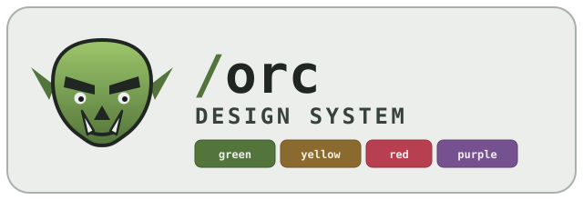

<p align="center">
  
</p>

<p align="center"><b>Framework-neutral Orc design foundations and Web Components — one swamp palette, shared everywhere.</b></p>

Orc Design System is the single source of truth for Orc's restrained swamp
identity: a 16-color semantic palette, type and motion rules, and a small set of
standards-based Web Components. Everything ships as plain CSS, JSON, and custom
elements, so any framework — or none — can consume it without copying color
values around.

## What it ships

- **Semantic tokens** — the `--orc-*` CSS custom properties and a stable
  `{ day, night }` JSON schema. Green, yellow, red, orange, purple, and cyan
  keep the fixed meanings documented in `.impeccable/design.json`.
- **Automatic theming** — the stylesheet follows system preference by default;
  an explicit `data-theme="light"` / `data-theme="dark"` on the root wins either
  way. A parser-time `preflight.js` avoids the first-paint flash for persisted
  choices.
- **Web Components** — `<orc-button>`, `<orc-chip>`, `<orc-dialog>`,
  `<orc-input>`, `<orc-navbar>`, `<orc-status-dot>`, `<orc-stepper>`,
  `<orc-tabs>`, `<orc-textarea>`, and `<orc-theme-toggle>`, defined via
  `defineOrcElements()` and driven by an exported `createThemeController()`.
- **Utility CSS** — opt-in `scrollbar.css` (`.orc-scrollbar`) and
  `typography.css` (`--orc-type-*` variables + `.orc-type-*` classes).
- **Fonts** — opt-in Inter (body) and JetBrains Mono (code); the platform sans
  and mono stacks are the default so nothing is required.
- **Preflight & assets** — the theme preflight snippet plus the packaged Orc
  marks (`orc-logo.svg`, `orc-icon.svg`).

## Install

[Bun](https://bun.sh/) is the project's package manager and script runner.

```bash
bun install
```

## Usage

Import the tokens before your application styles, then use the public roles:

```css
@import "@orc-tools/orc-design-system/tokens.css";

.card {
  background: var(--orc-panel);
  color: var(--orc-text);
  border: 1px solid var(--orc-border);
}
```

Register the components and let the controller manage theme:

```ts
import { defineOrcElements } from "@orc-tools/orc-design-system/define";

defineOrcElements();
// <orc-navbar> and <orc-theme-toggle> are now usable in your markup.
```

Non-CSS consumers can read the palette directly, including the derived roles
resolved to hex per theme:

```ts
import tokens from "@orc-tools/orc-design-system/tokens.json";

const lightThemeColor = tokens.day.bg;
const darkThemeColor = tokens.night.bg;
const lightGate = tokens.derived.day.gate;
```

See [`docs/theme-consumption.md`](docs/theme-consumption.md) for the full theming
contract and the list of derived roles.

## Upgrading

Each breaking release ships a migration beside it. From a consumer project:

```bash
npx @orc-tools/orc-design-system migrate --dry-run   # show what would change
npx @orc-tools/orc-design-system migrate             # apply, nothing committed
```

Mechanical changes are applied; anything that is a design decision is reported
for you to settle. A new breaking release needs a matching
`migrations/<version>-<slug>.mjs`.

To move every consumer at once, list them in `consumers.json` and run from this
repo:

```bash
bun run rollout --dry-run     # per-project report, no writes
bun run rollout               # branch, bump, migrate, build, test, commit
bun run rollout --pr          # ...and push + open PRs
```

Projects with uncommitted changes are skipped, a failed build stops that project
only, and nothing is pushed without `--pr`.

## Develop

```bash
bun run storybook       # component workbench + docs at :6006
bun run test            # unit + browser tests (Vitest)
bun run typecheck       # type-only pass
bun run build           # theme check → Vite build → static assets → verify
```

`bun run consumer:proof` packs the library and builds a real Vite consumer to
prove the published package works end to end.

## The palette is the API

Consumers import token surfaces instead of copying hex values, so the swamp
identity can evolve in one place. Ordinary UI color must always flow through the
semantic `--orc-*` roles — the logo and icon artwork keep their own first-party
colors and never define interface token meaning.

## License

The **code** — tokens, components, styles, and scripts — is [MIT](LICENSE). Fork
it, ship it, sell it; keep the copyright notice.

The **marks are not**. The Orc name and the emblem, icon, and lockup artwork
(`orc-logo.svg`, `orc-icon.svg`, `orc-design-system-logo.svg`) are reserved — no
trademark or brand licence is granted here. Build on the system, but use your own
identity. See [`src/assets/ASSETS.md`](src/assets/ASSETS.md) for their provenance.

The packaged fonts carry their own terms: Inter and JetBrains Mono are
distributed under the SIL Open Font License 1.1 (see
[`src/assets/fonts/PROVENANCE.md`](src/assets/fonts/PROVENANCE.md)). They are
opt-in — the default stacks are the platform sans and mono.
